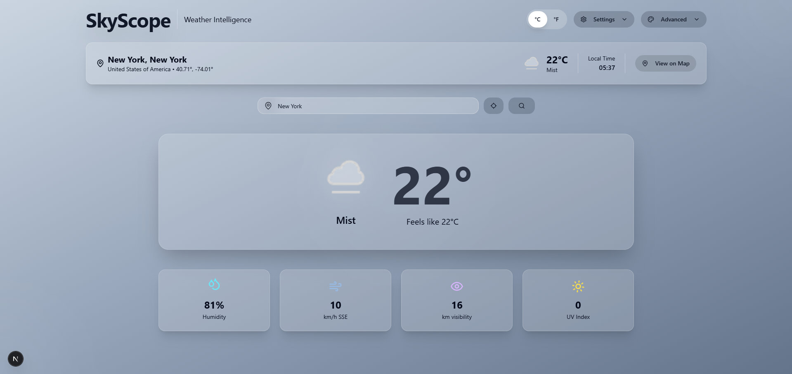
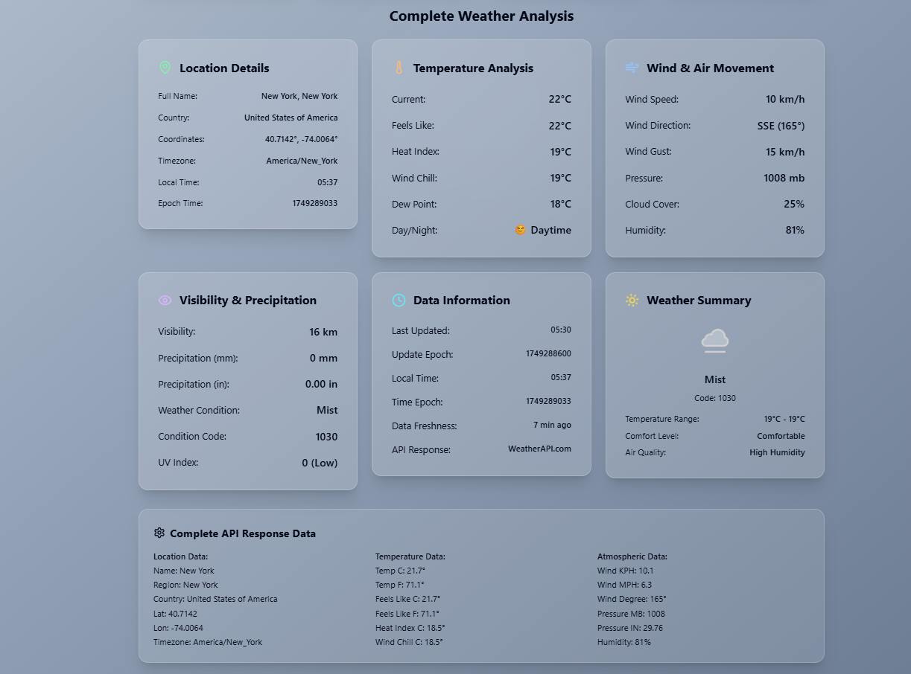

# 🌤️ SkyScope – Weather Intelligence App

**SkyScope** is a modern and responsive weather intelligence web app built with **Next.js**, **TypeScript**, and **Tailwind CSS**. It provides accurate real-time weather data along with rich visual and analytical features for users who want a deeper understanding of atmospheric conditions.

---

## 🚀 Features

### 🔎 Search & Display
- **Search by City Name**: Get current weather data by entering any city.
- **Google Maps Integration**: Instantly view the searched city on Google Maps.

### 📊 Weather Analytics
- **Location Details**: City, country, latitude & longitude.
- **Temperature Overview**: Display in Celsius, Fahrenheit, or Kelvin.
- **Wind & Air Movement**: Wind speed, direction, pressure, and humidity.
- **Visibility & Precipitation**: Cloud cover, precipitation probability, and visibility distance.
- **Weather Summary**: A short, human-readable summary of the current conditions.

### 🎨 Interactive UI
- **Dynamic Background**: Changes based on weather conditions.
- **Hover Effects**: Smooth and intuitive interactions.
- **Responsive Design**: Fully functional across desktop and mobile devices.

### 🔐 Secure & Efficient
- **Environment Variables**: API key stored in `.env` (excluded from GitHub).
- **Weather API Integration**: Uses [WeatherAPI.com](https://www.weatherapi.com) for real-time data.

---

## 🧪 Tech Stack

- **Framework**: [Next.js](https://nextjs.org/)
- **Language**: [TypeScript](https://www.typescriptlang.org/)
- **Styling**: [Tailwind CSS](https://tailwindcss.com/)
- **API**: [WeatherAPI.com](https://www.weatherapi.com)

---

## 📦 Getting Started

### 1. Clone the Repository
```bash
git clone https://github.com/yourusername/skyscope.git
cd skyscope
```

### 2. Install Dependencies
```bash
npm install
```

### 3. Setup Environment Variables
Create a `.env.local` file in the root directory and add your WeatherAPI key:
```
NEXT_PUBLIC_WEATHER_API_KEY=your_weatherapi_key_here
```

### 4. Run the App
```bash
npm run dev
```

### 5. Build for Production
```bash
npm run build
npm start
```

---

## 📸 Screenshots

 >### 🌤️ Main View
> 

> ### 📊 Advanced Weather View
> 

---

## 📄 License

MIT License

Copyright (c) 2025

Permission is hereby granted, free of charge, to any person obtaining a copy
of this software and associated documentation files (the "Software"), to deal
in the Software without restriction, including without limitation the rights
to use, copy, modify, merge, publish, distribute, sublicense, and/or sell
copies of the Software, and to permit persons to whom the Software is
furnished to do so, subject to the following conditions:

The above copyright notice and this permission notice shall be included in
all copies or substantial portions of the Software.

THE SOFTWARE IS PROVIDED "AS IS", WITHOUT WARRANTY OF ANY KIND, EXPRESS OR
IMPLIED, INCLUDING BUT NOT LIMITED TO THE WARRANTIES OF MERCHANTABILITY,
FITNESS FOR A PARTICULAR PURPOSE AND NONINFRINGEMENT. IN NO EVENT SHALL THE
AUTHORS OR COPYRIGHT HOLDERS BE LIABLE FOR ANY CLAIM, DAMAGES OR OTHER
LIABILITY, WHETHER IN AN ACTION OF CONTRACT, TORT OR OTHERWISE, ARISING FROM,
OUT OF OR IN CONNECTION WITH THE SOFTWARE OR THE USE OR OTHER DEALINGS IN
THE SOFTWARE.

---

> ## 🌐 Live Demo (Optional)
> [](https://sky-scope-weather-intelligence.vercel.app/)
---

## 🙌 Contributions

Feel free to open issues or submit pull requests. Contributions are welcome!

---

## ⭐ Support

If you find this project helpful, give it a ⭐ on [GitHub](https://github.com/yourusername/skyscope)!
